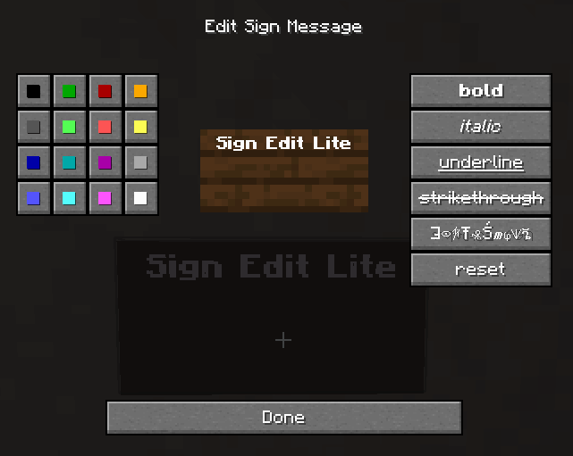
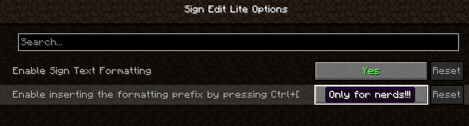

# Sign Edit Lite (Fabric and NeoForge)  

Add color and formatting options to signs.

The mod comes with usual Mod Menu integration. 

An additional extra for nerds, who prefer typing raw formatting codes, is the option to enable the insertion of the formatting character '§' by pressing Ctrl+[. 

## Requires (Fabric)

- [Fabric API](https://modrinth.com/mod/fabric-api)  
- [Cloth Config API](https://modrinth.com/mod/cloth-config)
- Optional, but recommended [Mod Menu](https://modrinth.com/mod/modmenu)

## License

Standard MIT license. Feel free to learn from it and incorporate it in your own projects.  
Some parts of the code are based on the source code of [Text Utilities](https://github.com/ChristopherHaws/mc-text-utilities), which is LGPL-3 licensed. 

## Source code

Available on [GitLab](https://gitlab.com/pintergabor/signeditlite.git) or on [GitHub](https://github.com/pinter-gabor-at/signeditlite.git).  
The source code has lots of comments to help learning Minecraft modding.

## Related projects

- [Text Utilities](https://modrinth.com/mod/text-utilities) adds color and formatting options to signs, book and anvils, but unfortunately it has not been updated to Minecraft 1.21.5 version at the time of writing, and it is a Fabric only mod.  
- [Iron Signs](https://modrinth.com/mod/ironsigns) adds vibrant, high contrast, painted signs, which can be colored and formatted similarily. It also enables coloring and formatting Vanilla wooden signs exactly the same way as this mod. I wonder who wrote that mod.

## Thanks

Thanks to [Chaws](https://modrinth.com/user/Chaws) for making available the source code of [Text Utilities](https://modrinth.com/mod/text-utilities).

## See also

My other mods on [Modrinth](https://modrinth.com/user/pinter.gabor) and on [CurseForge](https://www.curseforge.com/members/pintergabor/projects).
